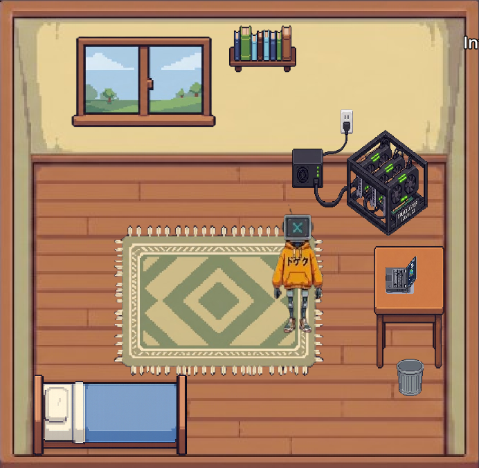
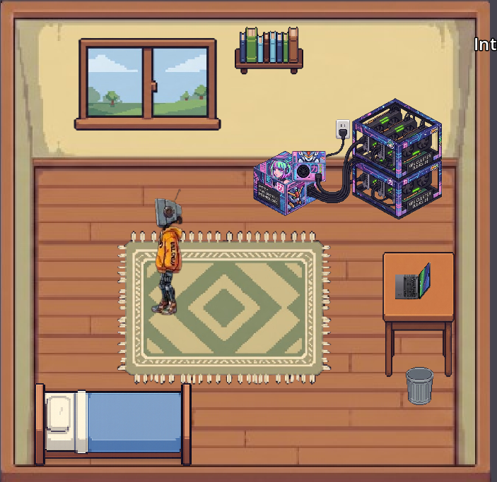

# DormGPT

DormGPT is a Godot-based 2D game where you manage a GPU cluster in a dorm room to train language models, earn money, and scale up your infrastructure.

This game was **made by codex for their game jam**.

## Screenshots

## Features

- **GPU Training & Management**: Hire, upgrade, and optimize your GPUs to train models of increasing sizes and capacities.
- **Model Progression**: Train and release a series of custom models:
  1. TinyGPT
  2. MiniGPT
  3. PicoGPT
  4. NanoGPT
  5. BaseGPT
  6. SmartGPT
  7. UltraGPT
  8. MegaGPT
  9. OmniGPT
  10. AGI-X
- **Upgrade System**: Purchase upgrades to speed up training, increase power, and maximize efficiency.
- **Dynamic Audio Experience**: Dynamic background music loops with custom walk/interaction sound ducking for immersive gameplay.

## Controls

- **W, A, S, D**: Move around the dorm room.
- **E**: Interact with laptops, GPUs, and other equipment to manage upgrades and training.

---
*Created for the Game Jam by **codex**.*
